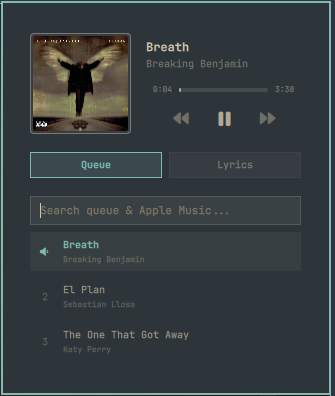
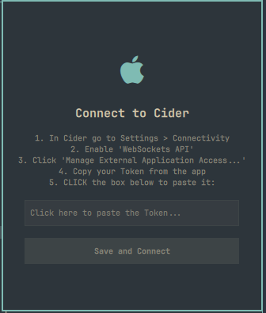

# Mini Cider for Omarchy 🎵

A beautiful, native, and highly responsive mini-player widget for [Cider 2](https://cider.sh/) (Apple Music), built specifically for the Omarchy desktop environment.

<p align="center">
  
  
</p>

## ✨ Features
* **Native Omarchy Integration**: Sits cleanly in your top bar and drops down into a sleek, Wayland-friendly floating panel.
* **Smart Artwork & Metadata**: Fetches high-resolution album art with built-in Apple Music CDN fallbacks to prevent missing covers.
* **Synchronized Lyrics**: Real-time lyrics powered by LRCLIB, featuring a buttery-smooth, hardware-accelerated dynamic crossfade effect as lines scroll.
* **Spotlight-style Keyboard Navigation**: Navigate search results, queue songs, and control playback without touching your mouse.
* **Instant Queueing**: Queue tracks locally or from Apple's global catalog with automatic regional routing.

## 🚀 Installation

1. Install the plugin using the Omarchy CLI:
   ```bash
   omarchy plugin add https://github.com/pwn27sbx/omarchy-mini-cider.git --enable
   ```
2. Click the musical note in your Omarchy top bar. The widget will guide you through a quick, interactive onboarding to securely link your Cider API Token!

## 🗑️ Removal

To uninstall the plugin, run:

```bash
omarchy plugin remove pwnsxb.apple-music
```

The saved Cider token is kept outside the plugin folder. To delete it too:

```bash
rm -rf "${XDG_STATE_HOME:-$HOME/.local/state}/mini-cider"
```

## 🔒 Privacy and network access

Mini Cider talks to exactly these endpoints, and nothing else:

- **`http://127.0.0.1:10767`** — the local Cider desktop app's own API, used
  for playback control, the queue and now-playing metadata. Requests
  include your app token, which is stored at
  `$XDG_STATE_HOME/mini-cider/token` (defaults to
  `~/.local/state/mini-cider/token`) with `0600` permissions and is never
  passed as a command-line argument or an environment variable.
- **Apple's iTunes Search API** (`itunes.apple.com`) — used to search the
  Apple Music catalog. Only your search text and a two-letter country code
  are sent; the country code is derived from your system locale, not from
  an IP-geolocation lookup.
- **`lrclib.net`** — used to fetch synchronized lyrics for the currently
  playing track, using only its title and artist name.
- **Apple's artwork CDN** (`*.mzstatic.com`) — album covers and search
  thumbnails are loaded from here; any other image URL is ignored.

No other network access is made by the plugin.

The onboarding **Paste** button reads the clipboard only when you click it,
through `helpers/read_clipboard.py`: it reads at most 4 KiB from `wl-paste`,
rejects anything larger, multi-line or containing control characters, and
fills the token field only with a single line of up to 512 characters.

## ⌨️ Keyboard Shortcuts
- `Up/Down`: Navigate through search results.
- `Enter`: Instantly play the selected track.
- `Space`: Add the selected track to play next.
- `Left/Right`: Skip to Previous/Next track (when search is empty).

## 📄 License

Released under the [MIT License](LICENSE).

---
*Built with ❤️ by pwnsxb & Gabi*
